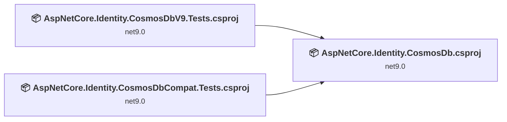
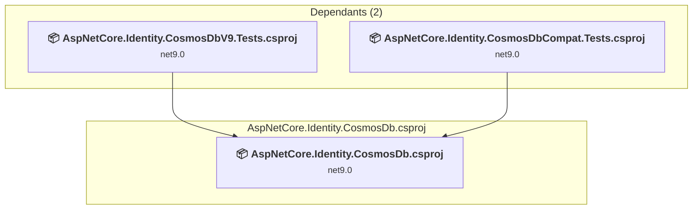
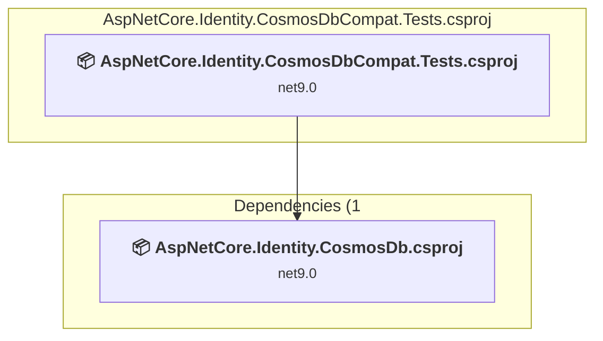
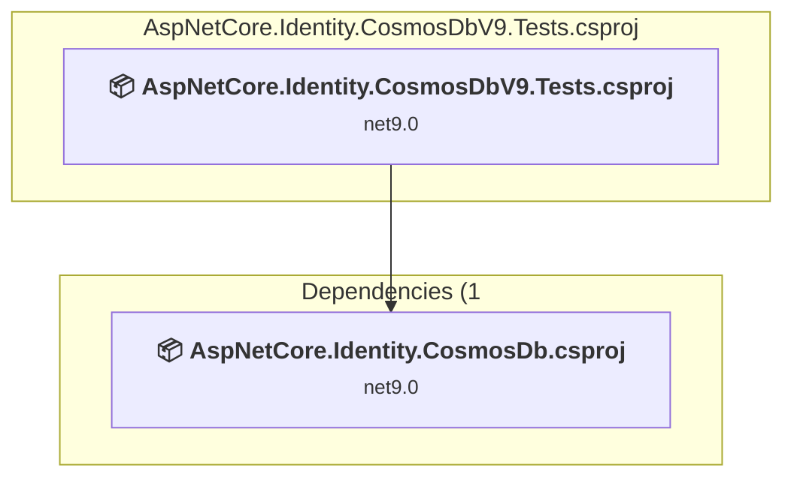

# Projects and dependencies analysis

This document provides a comprehensive overview of the projects and their dependencies in the context of upgrading to .NETCoreApp,Version=v10.0.

## Table of Contents

- [Executive Summary](#executive-Summary)
  - [Highlevel Metrics](#highlevel-metrics)
  - [Projects Compatibility](#projects-compatibility)
  - [Package Compatibility](#package-compatibility)
  - [API Compatibility](#api-compatibility)
- [Aggregate NuGet packages details](#aggregate-nuget-packages-details)
- [Top API Migration Challenges](#top-api-migration-challenges)
  - [Technologies and Features](#technologies-and-features)
  - [Most Frequent API Issues](#most-frequent-api-issues)
- [Projects Relationship Graph](#projects-relationship-graph)
- [Project Details](#project-details)

  - [AspNetCore.Identity.CosmosDb\AspNetCore.Identity.CosmosDb.csproj](#aspnetcoreidentitycosmosdbaspnetcoreidentitycosmosdbcsproj)
  - [AspNetCore.Identity.CosmosDbCompat.Tests\AspNetCore.Identity.CosmosDbCompat.Tests.csproj](#aspnetcoreidentitycosmosdbcompattestsaspnetcoreidentitycosmosdbcompattestscsproj)
  - [AspNetCore.Identity.CosmosDbV9.Tests\AspNetCore.Identity.CosmosDbV9.Tests.csproj](#aspnetcoreidentitycosmosdbv9testsaspnetcoreidentitycosmosdbv9testscsproj)

## Executive Summary

### Highlevel Metrics

| Metric | Count | Status |
| :--- | :---: | :--- |
| Total Projects | 3 | All require upgrade |
| Total NuGet Packages | 16 | 7 need upgrade |
| Total Code Files | 35 |  |
| Total Code Files with Incidents | 8 |  |
| Total Lines of Code | 7462 |  |
| Total Number of Issues | 18 |  |
| Estimated LOC to modify | 5+ | at least 0.1% of codebase |

### Projects Compatibility

| Project | Target Framework | Difficulty | Package Issues | API Issues | Est. LOC Impact | Description |
| :--- | :---: | :---: | :---: | :---: | :---: | :--- |
| [AspNetCore.Identity.CosmosDb\AspNetCore.Identity.CosmosDb.csproj](#aspnetcoreidentitycosmosdbaspnetcoreidentitycosmosdbcsproj) | net9.0 | 🟢 Low | 6 | 3 | 3+ | ClassLibrary, Sdk Style = True |
| [AspNetCore.Identity.CosmosDbCompat.Tests\AspNetCore.Identity.CosmosDbCompat.Tests.csproj](#aspnetcoreidentitycosmosdbcompattestsaspnetcoreidentitycosmosdbcompattestscsproj) | net9.0 | 🟢 Low | 1 | 1 | 1+ | DotNetCoreApp, Sdk Style = True |
| [AspNetCore.Identity.CosmosDbV9.Tests\AspNetCore.Identity.CosmosDbV9.Tests.csproj](#aspnetcoreidentitycosmosdbv9testsaspnetcoreidentitycosmosdbv9testscsproj) | net9.0 | 🟢 Low | 3 | 1 | 1+ | DotNetCoreApp, Sdk Style = True |

### Package Compatibility

| Status | Count | Percentage |
| :--- | :---: | :---: |
| ✅ Compatible | 9 | 56.3% |
| ⚠️ Incompatible | 0 | 0.0% |
| 🔄 Upgrade Recommended | 7 | 43.8% |
| ***Total NuGet Packages*** | ***16*** | ***100%*** |

### API Compatibility

| Category | Count | Impact |
| :--- | :---: | :--- |
| 🔴 Binary Incompatible | 0 | High - Require code changes |
| 🟡 Source Incompatible | 5 | Medium - Needs re-compilation and potential conflicting API error fixing |
| 🔵 Behavioral change | 0 | Low - Behavioral changes that may require testing at runtime |
| ✅ Compatible | 8454 |  |
| ***Total APIs Analyzed*** | ***8459*** |  |

## Aggregate NuGet packages details

| Package | Current Version | Suggested Version | Projects | Description |
| :--- | :---: | :---: | :--- | :--- |
| coverlet.collector | 6.0.4 |  | [AspNetCore.Identity.CosmosDbV9.Tests.csproj](#aspnetcoreidentitycosmosdbv9testsaspnetcoreidentitycosmosdbv9testscsproj) | ✅Compatible |
| Duende.IdentityServer.EntityFramework.Storage | 7.3.1 |  | [AspNetCore.Identity.CosmosDb.csproj](#aspnetcoreidentitycosmosdbaspnetcoreidentitycosmosdbcsproj) | ✅Compatible |
| Microsoft.AspNetCore.Identity.EntityFrameworkCore | 9.0.8 | 10.0.5 | [AspNetCore.Identity.CosmosDb.csproj](#aspnetcoreidentitycosmosdbaspnetcoreidentitycosmosdbcsproj) | NuGet package upgrade is recommended |
| Microsoft.AspNetCore.Identity.UI | 9.0.8 | 10.0.5 | [AspNetCore.Identity.CosmosDb.csproj](#aspnetcoreidentitycosmosdbaspnetcoreidentitycosmosdbcsproj) | NuGet package upgrade is recommended |
| Microsoft.EntityFrameworkCore.Cosmos | 9.0.8 | 10.0.5 | [AspNetCore.Identity.CosmosDb.csproj](#aspnetcoreidentitycosmosdbaspnetcoreidentitycosmosdbcsproj) | NuGet package upgrade is recommended |
| Microsoft.Extensions.Caching.Memory | 9.0.8 | 10.0.5 | [AspNetCore.Identity.CosmosDb.csproj](#aspnetcoreidentitycosmosdbaspnetcoreidentitycosmosdbcsproj) [AspNetCore.Identity.CosmosDbV9.Tests.csproj](#aspnetcoreidentitycosmosdbv9testsaspnetcoreidentitycosmosdbv9testscsproj) | NuGet package upgrade is recommended |
| Microsoft.Extensions.Configuration.UserSecrets | 9.0.8 | 10.0.5 | [AspNetCore.Identity.CosmosDbCompat.Tests.csproj](#aspnetcoreidentitycosmosdbcompattestsaspnetcoreidentitycosmosdbcompattestscsproj) [AspNetCore.Identity.CosmosDbV9.Tests.csproj](#aspnetcoreidentitycosmosdbv9testsaspnetcoreidentitycosmosdbv9testscsproj) | NuGet package upgrade is recommended |
| Microsoft.NET.Test.Sdk | 17.14.1 |  | [AspNetCore.Identity.CosmosDbCompat.Tests.csproj](#aspnetcoreidentitycosmosdbcompattestsaspnetcoreidentitycosmosdbcompattestscsproj) [AspNetCore.Identity.CosmosDbV9.Tests.csproj](#aspnetcoreidentitycosmosdbv9testsaspnetcoreidentitycosmosdbv9testscsproj) | ✅Compatible |
| Microsoft.Testing.Extensions.CodeCoverage | 17.14.2 |  | [AspNetCore.Identity.CosmosDbCompat.Tests.csproj](#aspnetcoreidentitycosmosdbcompattestsaspnetcoreidentitycosmosdbcompattestscsproj) | ✅Compatible |
| Microsoft.Testing.Extensions.TrxReport | 1.8.4 |  | [AspNetCore.Identity.CosmosDbCompat.Tests.csproj](#aspnetcoreidentitycosmosdbcompattestsaspnetcoreidentitycosmosdbcompattestscsproj) | ✅Compatible |
| Moq | 4.20.72 |  | [AspNetCore.Identity.CosmosDbCompat.Tests.csproj](#aspnetcoreidentitycosmosdbcompattestsaspnetcoreidentitycosmosdbcompattestscsproj) [AspNetCore.Identity.CosmosDbV9.Tests.csproj](#aspnetcoreidentitycosmosdbv9testsaspnetcoreidentitycosmosdbv9testscsproj) | ✅Compatible |
| MSTest | 3.10.4 |  | [AspNetCore.Identity.CosmosDbCompat.Tests.csproj](#aspnetcoreidentitycosmosdbcompattestsaspnetcoreidentitycosmosdbcompattestscsproj) | ✅Compatible |
| MSTest.TestAdapter | 3.10.4 |  | [AspNetCore.Identity.CosmosDbV9.Tests.csproj](#aspnetcoreidentitycosmosdbv9testsaspnetcoreidentitycosmosdbv9testscsproj) | ✅Compatible |
| MSTest.TestFramework | 3.10.4 |  | [AspNetCore.Identity.CosmosDbV9.Tests.csproj](#aspnetcoreidentitycosmosdbv9testsaspnetcoreidentitycosmosdbv9testscsproj) | ✅Compatible |
| Newtonsoft.Json | 13.0.3 | 13.0.4 | [AspNetCore.Identity.CosmosDb.csproj](#aspnetcoreidentitycosmosdbaspnetcoreidentitycosmosdbcsproj) | NuGet package upgrade is recommended |
| System.Text.Json | 9.0.8 | 10.0.5 | [AspNetCore.Identity.CosmosDb.csproj](#aspnetcoreidentitycosmosdbaspnetcoreidentitycosmosdbcsproj) [AspNetCore.Identity.CosmosDbV9.Tests.csproj](#aspnetcoreidentitycosmosdbv9testsaspnetcoreidentitycosmosdbv9testscsproj) | NuGet package upgrade is recommended |

## Top API Migration Challenges

### Technologies and Features

| Technology | Issues | Percentage | Migration Path |
| :--- | :---: | :---: | :--- |

### Most Frequent API Issues

| API | Count | Percentage | Category |
| :--- | :---: | :---: | :--- |
| M:System.TimeSpan.FromSeconds(System.Int64) | 4 | 80.0% | Source Incompatible |
| M:System.TimeSpan.FromMinutes(System.Int64) | 1 | 20.0% | Source Incompatible |

## Projects Relationship Graph

Legend:
📦 SDK-style project
⚙️ Classic project

## Project Details

### AspNetCore.Identity.CosmosDb\AspNetCore.Identity.CosmosDb.csproj

#### Project Info

- **Current Target Framework:** net9.0
- **Proposed Target Framework:** net10.0
- **SDK-style**: True
- **Project Kind:** ClassLibrary
- **Dependencies**: 0
- **Dependants**: 2
- **Number of Files**: 23
- **Number of Files with Incidents**: 4
- **Lines of Code**: 2630
- **Estimated LOC to modify**: 3+ (at least 0.1% of the project)

#### Dependency Graph

Legend:
📦 SDK-style project
⚙️ Classic project

### API Compatibility

| Category | Count | Impact |
| :--- | :---: | :--- |
| 🔴 Binary Incompatible | 0 | High - Require code changes |
| 🟡 Source Incompatible | 3 | Medium - Needs re-compilation and potential conflicting API error fixing |
| 🔵 Behavioral change | 0 | Low - Behavioral changes that may require testing at runtime |
| ✅ Compatible | 2523 |  |
| ***Total APIs Analyzed*** | ***2526*** |  |

### AspNetCore.Identity.CosmosDbCompat.Tests\AspNetCore.Identity.CosmosDbCompat.Tests.csproj

#### Project Info

- **Current Target Framework:** net9.0
- **Proposed Target Framework:** net10.0
- **SDK-style**: True
- **Project Kind:** DotNetCoreApp
- **Dependencies**: 1
- **Dependants**: 0
- **Number of Files**: 7
- **Number of Files with Incidents**: 2
- **Lines of Code**: 1818
- **Estimated LOC to modify**: 1+ (at least 0.1% of the project)

#### Dependency Graph

Legend:
📦 SDK-style project
⚙️ Classic project

### API Compatibility

| Category | Count | Impact |
| :--- | :---: | :--- |
| 🔴 Binary Incompatible | 0 | High - Require code changes |
| 🟡 Source Incompatible | 1 | Medium - Needs re-compilation and potential conflicting API error fixing |
| 🔵 Behavioral change | 0 | Low - Behavioral changes that may require testing at runtime |
| ✅ Compatible | 2187 |  |
| ***Total APIs Analyzed*** | ***2188*** |  |

### AspNetCore.Identity.CosmosDbV9.Tests\AspNetCore.Identity.CosmosDbV9.Tests.csproj

#### Project Info

- **Current Target Framework:** net9.0
- **Proposed Target Framework:** net10.0
- **SDK-style**: True
- **Project Kind:** DotNetCoreApp
- **Dependencies**: 1
- **Dependants**: 0
- **Number of Files**: 11
- **Number of Files with Incidents**: 2
- **Lines of Code**: 3014
- **Estimated LOC to modify**: 1+ (at least 0.0% of the project)

#### Dependency Graph

Legend:
📦 SDK-style project
⚙️ Classic project

### API Compatibility

| Category | Count | Impact |
| :--- | :---: | :--- |
| 🔴 Binary Incompatible | 0 | High - Require code changes |
| 🟡 Source Incompatible | 1 | Medium - Needs re-compilation and potential conflicting API error fixing |
| 🔵 Behavioral change | 0 | Low - Behavioral changes that may require testing at runtime |
| ✅ Compatible | 3744 |  |
| ***Total APIs Analyzed*** | ***3745*** |  |

