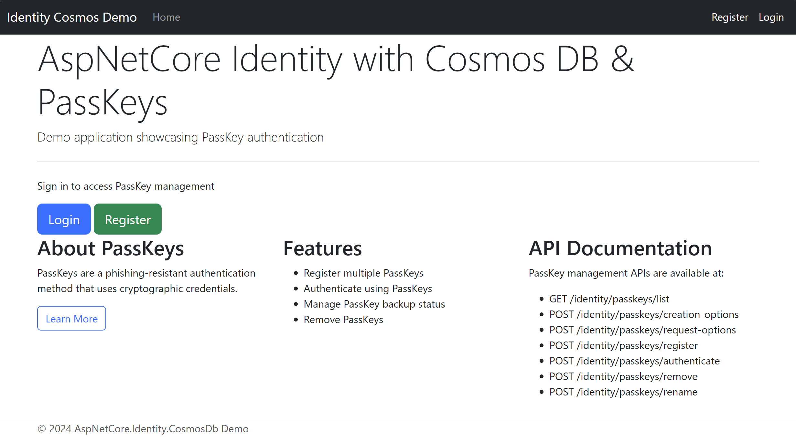
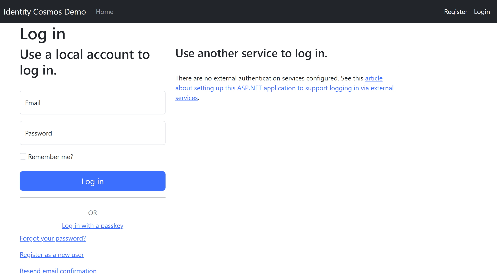
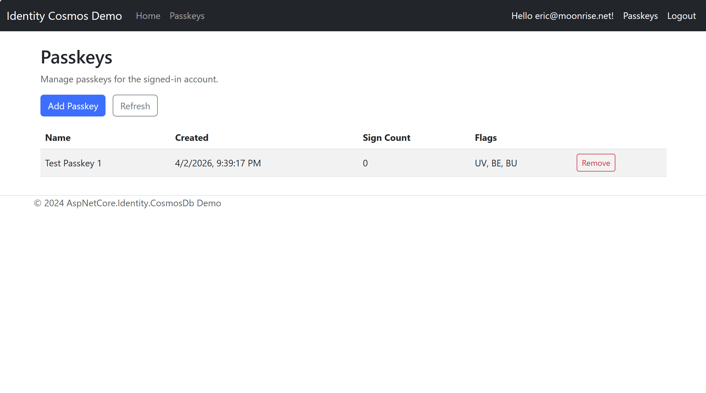

# AspNetCore.Identity.CosmosDb Demo Application

This demo application showcases ASP.NET Core Identity integrated with Azure Cosmos DB and PassKey authentication support.

## Features

- **ASP.NET Core Identity** with Cosmos DB backing
- **PassKey Management** - Register, authenticate, and manage PassKeys
- **RESTful API** for PassKey operations
- **Web UI** for identity management
- **Smoke Tests** for validating functionality

## Get This Demo Without Cloning

You can use this demo without cloning the full repository.

### Option 1: Scaffold from the demo template package

```powershell
dotnet new install CWALabs.AspNetCore.Identity.CosmosDb.DemoTemplate
dotnet new cosmos-identity-demo -n MyIdentityCosmosDemo
cd MyIdentityCosmosDemo
dotnet run
```

### Option 2: Download a source ZIP

Download `AspNetCore.Identity.CosmosDb.Demo-source.zip` from the repository release assets.

- This ZIP is produced by the GitHub Actions workflow at `.github/workflows/demo-package.yml`.
- It includes only the demo project content (without `bin/` or `obj/`) plus the repository `LICENSE`.

## Page Screenshots

These screenshots show the key pages developers will see when running the demo locally.

### Home (`HomeController.Index()` -> `Views/Home/Index.cshtml`)



### Login (`Areas/Identity/Pages/Account/Login.cshtml`)



### Passkeys (`Pages/Passkeys.cshtml`)



## Prerequisites

- .NET 10.0 SDK
- Azure Cosmos DB emulator or Azure Cosmos DB account
- Visual Studio 2022 or VS Code

## Setup

### 1. Configure Cosmos DB Connection

Edit `appsettings.json` and update the connection string:

```json
{
  "ConnectionStrings": {
    "CosmosDb": "Your-Cosmos-DB-Connection-String"
  },
  "CosmosDb": {
    "DatabaseName": "AspNetCoreIdentity"
  },
  "Passkeys": {
    "ServerDomain": null
  }
}
```

For local development with the Cosmos DB emulator:

```text
AccountEndpoint=https://localhost:8081/;AccountKey=C2y6yDjf5/R+ob0N8A7Cgv30VRDJIWEHLMZD+2d9M2wgD3vK8MyZN+DynERMCa3aSikZLecbGiujTjZtLWVLQECoj4X3R+O7apIDTPqyv6mQ==
```

`Passkeys:ServerDomain` can be `null` for localhost development. Set it explicitly in hosted environments (for example, `contoso.com`).

### 2. Run the Application

```bash
dotnet run
```

The application will start at `https://localhost:7001` (or similar).

### 3. Initial Setup

The application will automatically create the necessary Cosmos DB containers on first run.

## Using the Demo

### Web Interface

1. Click the Windows key and search for `Cosmos Emulator` to start the Cosmos DB emulator.
2. Click "Register" to create a new account
3. Log in with your credentials
4. Open `Passkeys` from the top navigation
5. Click `Add Passkey` to register a passkey via browser WebAuthn prompt
6. Use `Refresh` and `Remove` to manage registered passkeys

The `Passkeys` UI is implemented as a Razor Page at `/Passkeys` and uses the reusable passkey endpoint mapping from `AddCosmosPasskeyUiIntegration(...)` + `MapCosmosPasskeyUiEndpoints<IdentityUser>()`.

### PassKey API

The application uses .NET 10 Identity passkey APIs for challenge generation, attestation validation, and sign-in.

> The `/Passkeys` Razor Page calls these APIs with cookie authentication.

#### Get packaged client script

```bash
GET /identity/passkeys/client.js
```

#### Create registration options

```bash
POST /identity/passkeys/creation-options
Authorization: Cookie auth session
```

Returns JSON `PublicKeyCredentialCreationOptions` payload.

#### Complete registration

```bash
POST /identity/passkeys/register
Authorization: Cookie auth session
Content-Type: application/json

{
  "credentialJson": "<serialized PublicKeyCredential>",
  "name": "My PassKey"
}
```

Server flow:

- `SignInManager.PerformPasskeyAttestationAsync`
- `UserManager.AddOrUpdatePasskeyAsync`

#### Create authentication options

```bash
POST /identity/passkeys/request-options?username=user@example.com
```

`username` is optional and can be omitted for discoverable credentials.

#### Authenticate with passkey

```bash
POST /identity/passkeys/authenticate
Content-Type: application/json

{
  "credentialJson": "<serialized PublicKeyCredential>"
}
```

Server flow:

- `SignInManager.PasskeySignInAsync`

#### List PassKeys

```bash
GET /identity/passkeys/list
Authorization: Cookie auth session
```

#### Remove PassKey

```bash
POST /identity/passkeys/remove
Authorization: Cookie auth session
Content-Type: application/json

{
  "id": "base64-encoded-credential-id"
}
```

#### Rename PassKey

```bash
POST /identity/passkeys/rename
Authorization: Cookie auth session
Content-Type: application/json

{
  "id": "base64-encoded-credential-id",
  "name": "My Laptop Passkey"
}
```

## Testing

### Running Smoke Tests

```bash
dotnet test AspNetCore.Identity.CosmosDb.Demo.Tests
```

Smoke tests validate:

- User registration flow
- User login flow
- PassKey registration
- PassKey authentication
- PassKey listing and removal
- Concurrent operations

### Manual Testing

Use `curl` or Postman to test the APIs:

```bash
# Register a new user
curl -X POST https://localhost:7001/api/account/register \
  -H "Content-Type: application/json" \
  -d '{"email":"user@example.com","password":"Password123!"}'

# Login
curl -X POST https://localhost:7001/api/account/login \
  -H "Content-Type: application/json" \
  -d '{"email":"user@example.com","password":"Password123!"}'

# List PassKeys (requires authenticated cookie session)
curl -X GET https://localhost:7001/identity/passkeys/list
```

## Project Structure

```text
AspNetCore.Identity.CosmosDb.Demo/
├── Controllers/
│   ├── HomeController.cs          # Home/dashboard controller
├── Data/
│   └── CosmosIdentityDbContext.cs # Cosmos DB context configuration
├── Views/
│   ├── Home/
│   │   ├── Index.cshtml           # Home page
│   │   └── Privacy.cshtml         # Privacy page
│   └── Shared/
│       ├── _Layout.cshtml         # Master layout
│       └── _ViewStart.cshtml      # View initialization
├── Program.cs                      # Application startup configuration
├── appsettings.json               # Configuration settings
└── AspNetCore.Identity.CosmosDb.Demo.csproj

AspNetCore.Identity.CosmosDb.Demo.Tests/
├── PasskeyIntegrationTests.cs     # PassKey functionality tests
├── UserManagementTests.cs         # User management tests
└── AspNetCore.Identity.CosmosDb.Demo.Tests.csproj
```

## Configuration

### Identity Options

The application configures Identity with the following defaults:

- **Password**: Requires 8+ characters, uppercase, lowercase, digit
- **User Email**: Must be unique
- **Sign-in Cookie**: Default timeout settings

To customize these, edit `Program.cs` in the `AddIdentity` section.

### Cosmos DB Containers

The application creates the following Cosmos DB containers:

- `AspNetUsers` - Stores user accounts
- `AspNetRoles` - Stores roles
- `AspNetUserPasskeys` - Stores PassKey credentials
- `AspNetUserClaims` - Stores user claims
- `AspNetUserRoles` - Stores user role assignments
- `AspNetUserLogins` - Stores external logins
- `AspNetRoleClaims` - Stores role claims
- `AspNetUserTokens` - Stores user tokens

Each container is partition-keyed for optimal performance.

## Development

### Adding New Features

1. **Add API Endpoints**: Add route handlers via `MapCosmosPasskeyUiEndpoints<IdentityUser>()` or create new controllers for non-passkey features
2. **Modify Data Model**: Update `CosmosIdentityDbContext` as needed
3. **Add UI**: Create new views/pages in `Views/` folder

### Database Migrations

Since Cosmos DB is schema-less, no formal migrations are needed. The `DbContext.Database.EnsureCreated()` in `Program.cs` handles container creation.

## Troubleshooting

### Cosmos DB Connection Issues

- Verify connection string in `appsettings.json`
- Check firewall rules if using Azure Cosmos DB
- Ensure Cosmos DB emulator is running for local development

### Authentication Issues

- Clear browser cookies and try again
- Check application logs for detailed error messages
- Verify Identity configuration in `Program.cs`

### PassKey Issues

- Ensure HTTPS is enabled (WebAuthn/passkeys require HTTPS).
- Set `Passkeys:ServerDomain` for production hosts.
- Use browser-produced credential JSON from `navigator.credentials.create/get`.
- If a password manager throws `PublicKeyCredential.toJSON` errors, apply the documented manual serialization workaround from Microsoft Learn.
- For local testing, use a WebAuthn-capable browser and platform authenticator (for example, Windows Hello).

## References

- [ASP.NET Core Identity Documentation](https://learn.microsoft.com/aspnet/core/security/authentication/identity)
- [Entity Framework Core Cosmos DB Provider](https://learn.microsoft.com/ef/core/providers/cosmos/)
- [WebAuthn/PassKeys Standard](https://webauthn.io/)

## License

This demo is part of the AspNetCore.Identity.CosmosDb project.
